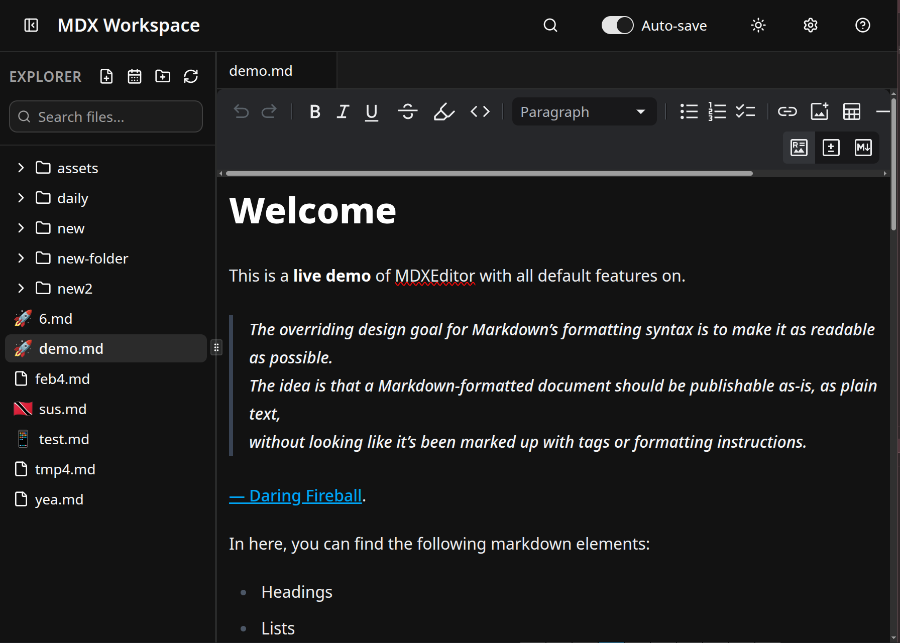

# MDX Workspace

> A local-first PWA markdown editor with WYSIWYG editing, workspace management, and full-text search.



## Features

- WYSIWYG markdown editing powered by `@mdxeditor/editor` (Lexical-based)
- Local filesystem workspaces via the File System Access API
- File explorer tree with create, rename, delete, refresh, and emoji file icons
- Tabbed editing with active tab state and dirty file indicators
- Auto-save with 300ms debounce and manual save shortcut (`Ctrl/Cmd+S`)
- In-editor find/replace with CSS Highlight API support
- Workspace-wide full-text search powered by MiniSearch (fuzzy + prefix matching)
- Rich text, source, and diff views for comparing edits against saved disk content
- Image paste/drop upload to workspace `assets/` with relative markdown paths
- Code block editing with CodeMirror language support
- Command palette quick-open (`Ctrl/Cmd+P`)
- Installable PWA with offline support and automatic updates

## Tech Stack

- React 19 + React Compiler
- TypeScript (strict mode)
- Vite 7
- Tailwind CSS v4 + shadcn/ui
- `@mdxeditor/editor`
- MiniSearch
- `idb-keyval` (IndexedDB persistence)
- `vite-plugin-pwa` (Workbox)

## Getting Started

### Prerequisites

- Node.js 18+ or Bun
- Chromium-based browser (Chrome, Edge, Brave, Opera)

### Install

```bash
bun install
```

### Development

```bash
bun run dev
```

### Build

```bash
bun run build
```

### Preview Production Build

```bash
bun run preview
```

## Keyboard Shortcuts

| Shortcut | Action |
| --- | --- |
| `Ctrl/Cmd + P` | Quick open file (command palette) |
| `Ctrl/Cmd + S` | Save active file |
| `Ctrl/Cmd + W` | Close active tab |
| `Ctrl/Cmd + F` | Find in current file |
| `Ctrl/Cmd + Shift + F` | Search across workspace |
| `Ctrl/Cmd + B` | Toggle sidebar |
| `F2` | Rename selected file/folder |
| `Escape` | Close dialogs/search panels |

For the full reference, see `KEYBOARD_SHORTCUTS.md`.

## Browser Requirements

- Uses File System Access API for direct file reads/writes
- Uses CSS Highlight API for in-editor search highlighting
- Best experience is currently Chromium-based browsers

## License

MIT
